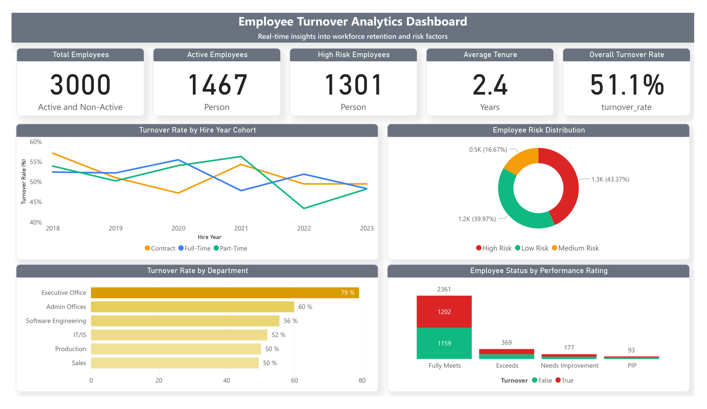

# People Analytics Portfolio Project

This project showcases a comprehensive people analytics solution that transforms HR data into actionable insights. It demonstrates skills in data engineering, analytics, and visualization to address key HR challenges.



## Project Overview

This project provides end-to-end analytics for HR data, including:

1. **Data Integration & Transformation**: Using dbt for SQL-based transformations
2. **Predictive Modeling**: Machine learning models for turnover prediction
3. **Interactive Dashboards**: PowerBI visualizations for key HR metrics
4. **Exploratory Analysis**: Jupyter notebooks for data exploration and visualization

## Key Features

- **Employee Turnover Prediction**: ML model to identify employees at risk
- **Recruitment Analytics**: Insights into hiring efficiency and candidate sources
- **Training Effectiveness**: Analysis of training programs and ROI (WIP)
- **Employee Engagement**: Correlation between engagement and performance (WIP)

## Technical Stack

- **Database**: PostgreSQL
- **Data Transformation**: dbt (data build tool)
- **Programming Languages**: Python, SQL
- **Machine Learning**: scikit-learn, pandas
- **Analysis Environment**: Jupyter Notebooks
- **Visualization**: PowerBI
- **Deployment**: Docker and Docker Compose

## Project Structure

```
├── data/                # Source data directory
│   └── raw/             # Raw CSV data files with metadata
├── dbt/                 # dbt models and configurations
│   ├── dbt_packages/    # External dbt packages
│   ├── dbt_project.yml  # dbt project configuration
│   ├── logs/            # dbt execution logs
│   ├── models/          # SQL transformation models
│   │   ├── staging/     # Initial data cleaning models
│   │   ├── intermediate/ # Business logic and metrics
│   │   └── marts/       # Final dimensional models
│   ├── profiles/        # dbt connection profiles
│   ├── seeds/           # Seeds with raw data for dbt
│   └── target/          # Compiled dbt artifacts and run results
├── docker/              # Docker configuration files
│   ├── dbt.Dockerfile   # Dockerfile for dbt environment
│   └── ml.Dockerfile    # Dockerfile for ML environment
├── docker-compose.yml   # Docker Compose configuration
├── ml/                  # Machine learning code
│   ├── data-analysis-eda.ipynb  # Exploratory data analysis
│   ├── model_metrics.txt        # Performance metrics documentation
│   ├── predict_turnover.py      # Prediction script
│   ├── requirements.txt         # Python dependencies
│   └── turnover_model.pkl       # Serialized ML model
├── notebook/            # Jupyter notebooks for analysis
│   ├── employee-dataset-data-cleaning-for-sql-import.ipynb
│   ├── ini.ipynb
│   ├── performance-and-attrition-retention-analysis.ipynb
│   └── predicting-turnover-with-95-accuracy.ipynb
├── powerbi/             # PowerBI dashboard documentation
├── scripts/             # Utility scripts for the project
│   └── ingest_data.py   # Data ingestion script
└── setup.sh             # Project setup script
```

## Getting Started

1. Clone this repository
2. Make the setup script executable: `chmod +x setup.sh`
3. Run `./setup.sh` to initialize the complete environment
   - This will start PostgreSQL container
   - Load seed data using dbt
   - Run dbt models to transform data
   - Execute dbt tests
   - Train ML model and generate predictions

4. Connect to the database:
   - Host: localhost
   - Port: 5432
   - User: postgres
   - Password: postgres
   - Database: people_analytics

5. Review notebooks in the `notebook/` directory for detailed analysis

For manual execution:
```
# Start containers
docker-compose up -d

# Load seed data
docker-compose run --rm dbt dbt seed --profiles-dir=/usr/app/dbt/profiles

# Run dbt models
docker-compose run --rm dbt dbt run --profiles-dir=/usr/app/dbt/profiles

# Train ML model
docker-compose run --rm ml python /usr/app/ml/predict_turnover.py
```

## Business Value

This solution provides valuable insights for HR teams:

- Identify employees at risk of leaving (95% accuracy)
- Optimize recruitment strategies
- Improve training ROI (WIP)
- Enhance employee engagement and satisfaction (WIP)
- Support data-driven HR decision making
